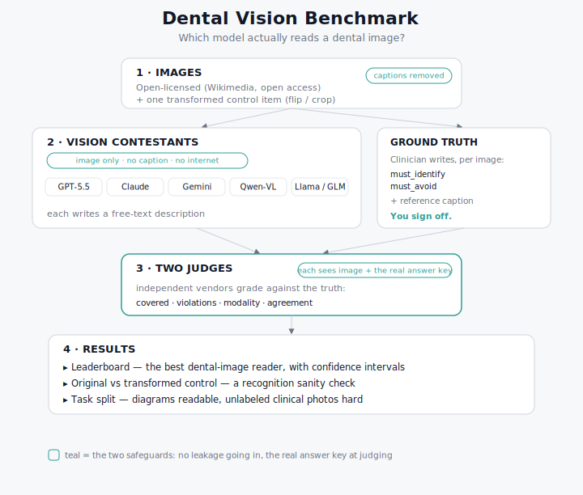

# Dental Vision Benchmark

**Which AI model can actually read a dental image?**


Clinicians already show AI a clinical photo, a diagram, or a figure from a paper and
ask "what is this?". The models sound confident, but no public benchmark measures which
one actually *reads* a dental image correctly. This is a small, clinician-authored,
contamination-aware benchmark that does. Scope is dental and clinical diagrams,
illustrations, and clinical images/figures from open-access articles. Radiographic
interpretation is a separate, harder competency and is deliberately out of scope for v1.

## How it works



The whole method rests on two safeguards:

1. **Leakage guard going in.** Each model is shown the image and nothing else. The
   caption is stripped, the image is sent inline as base64, and no tools are passed,
   so the model cannot search the web to recover the original caption. A high score
   can only come from reading the picture.
2. **Grounded judging.** Two independent judges from different vendors each *see* the
   image and hold the authoritative caption plus the clinician rubric, then grade the
   model's description against the real answer. Their agreement is reported, so the
   absolute numbers are not taken on faith.

On top of that, a **private control** measures training-data memorization: a
transformed copy of a public image (flipped and cropped) keeps the clinical content
identical while defeating exact-image recognition. A model that truly reads the image
scores the same on the control; a model that memorized the original drops.

## What it measures

- **Leaderboard** — rubric pass-rate per model (does the description satisfy the
  clinician's `must_identify` points and commit none of the `must_avoid` errors).
- **Modality accuracy** — does the model know a diagram from a radiograph from a
  clinical photo.
- **Memorization gap** — accuracy on the original public image vs the transformed
  control.
- **Judge agreement** — primary judge vs an independent second judge.

## The lineup

The latest vision-capable model of each family (verified image-capable on OpenRouter):

| Model | OpenRouter id |
|---|---|
| GPT-5.5 | `openai/gpt-5.5` |
| Claude Opus 4.8 | `anthropic/claude-opus-4.8` |
| Gemini 3.1 Pro | `google/gemini-3.1-pro-preview` |
| Qwen3.7 Plus | `qwen/qwen3.7-plus` |
| Llama 4 Maverick | `meta-llama/llama-4-maverick` |
| GLM-4.6V | `z-ai/glm-4.6v` |

The brand-new open-source GLM-5.2 and Rio 3.5 Open 397B are **text-only**, so they
cannot enter a vision benchmark.

## Quickstart

```bash
python -m venv .venv && source .venv/bin/activate
pip install -r requirements.txt
export OPENROUTER_API_KEY=...        # one key reaches every model
python src/run_vision_eval.py
```

To rebuild the memorization control image or the credits file:

```bash
python tools/make_control.py
python tools/build_credits.py
```

## Status

**v0.2, draft. Do not cite.** The current item set is a 7-image smoke test with
DRAFT ground truth. The numbers in `results/` prove the pipeline works; they are not
a result. The roadmap to a real v1:

- [ ] Clinician sign-off on every item's ground truth (a `VALIDATION.md`, as in the
      sibling text benchmark).
- [ ] Expand to 30 to 40 images across buckets (anatomy, perio, caries, implants,
      clinical photos and figures from open-access articles), chosen for readable
      ground truth and mostly unlabeled.
- [ ] Grow the private control subset (own or paywalled images, never redistributed)
      to quantify memorization properly.
- [ ] Report confidence intervals; the top of a small leaderboard is noise.

## Dataset and licensing

Images are openly licensed (Wikimedia Commons / CC0); per-image attribution is in
[`CREDITS.md`](CREDITS.md). Ground truth lives in
[`data/items.json`](data/items.json) as `must_identify` / `must_avoid` rubrics plus a
reference caption. The benchmark code is MIT; the images keep their own licenses.

## Related work

Complementary to OralMLLM-Bench (multimodal dental radiographs) and the text-only
dental QA benchmarks. This one is dental diagrams, illustrations, and clinical
images/figures from open-access articles, scored by caption-match, contamination-aware,
and fully public. Radiographic interpretation is intentionally a separate, later tier.

Author: Francisco Teixeira Barbosa (Periospot / Foundation for Oral Rehabilitation).
